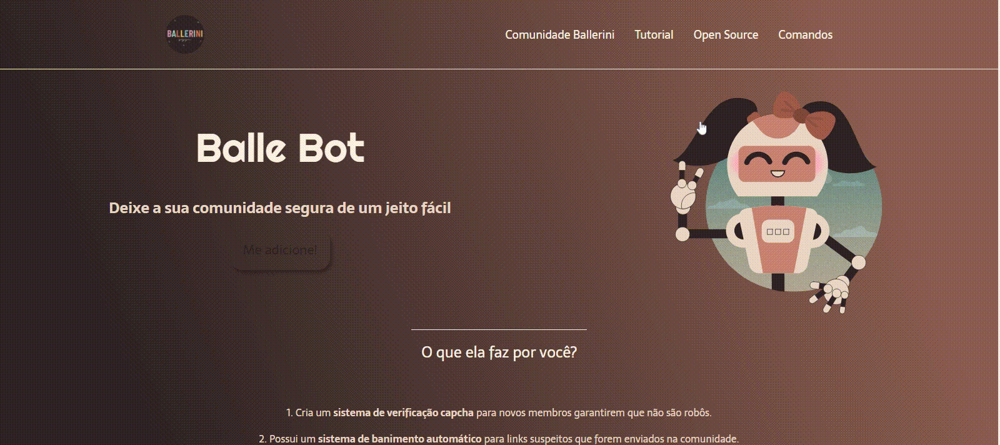

# Balle Bot 🤖

## ✨ Resultado
### Desktop 🖥

### Mobile 📱

Balle Bot é um bot desenvolvido pela staff da comunidade Ballerini. É um projeto open-source. 
 

✨ Adicionei no projeto uma versão mobile e alguns efeitos quando o usuário passasse o mouse. Para a versão do menu, a parte do nav, criei o  menu hambúrguer.

   
- 📝 Link do Projeto: https://www.figma.com/file/myqP66iQwzjwjrIAJyyrip/BalleBot?node-id=0%3A1

- 🎬 Vídeo da Rafa: https://www.youtube.com/watch?v=llF6vD-RljE
 
- 🖥 Site: https://melribeiro.github.io/Balle-Bot/

### 🔨 Construído com:
- HTML semântico
- CSS
- JS 

